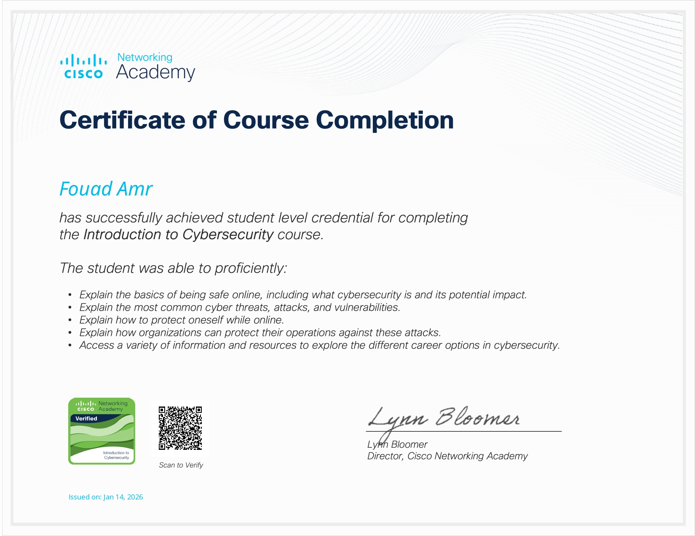
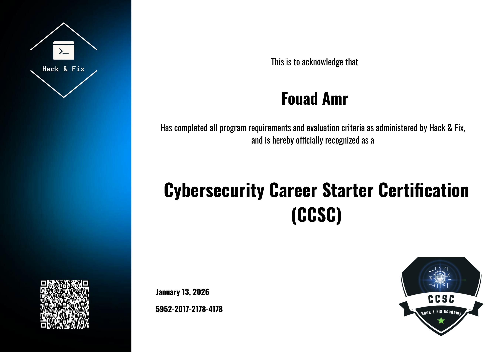

# 👋 Hi, I'm Fouad Amr

**IT Support | IT Infrastructure**, based in Matrouh, Egypt

IT professional with hands-on experience in IT support, Windows Server, Active Directory, and network infrastructure in hotel environments. Currently working toward CompTIA Security+, Network+ and CCNA, with a growing focus on cybersecurity.

## 💼 What I Do
- Windows Server, Active Directory, Group Policy (GPO)
- Network support: switches, wireless Access Points, TCP/IP, DNS, DHCP
- Backup and recovery, hardware and software troubleshooting
- Microsoft Azure and Microsoft Entra ID (hands-on training)

## 🚀 Projects
| Project | Description | Tech |
|---|---|---|
| [NetSecToolkit](https://github.com/fouadamrr/NetSecToolkit) | Browser-based network & security toolkit: subnet calculator, ports reference, bandwidth converter, encoding/decoding tools, and AES-256-GCM encryption. [Live demo](https://fouadamrr.github.io/NetSecToolkit/) | HTML, CSS, JavaScript, Web Crypto API |
| [EDU-Nexus](https://github.com/fouadamrr/EDU-Nexus) | University management system with online exams, QR code attendance, course registration, and role-based access. Secure coding: PDO prepared statements, BCrypt password hashing. | PHP, PostgreSQL, Tailwind CSS |

## 🛠 Tools
Nmap, Wireshark, Burp Suite, Metasploit, Nessus, Gobuster, Kali Linux, VMware, VirtualBox

## 📜 Certifications & Learning
- Network Foundation, Cisco Networking Academy — [View Certificate (PDF)](certs/Cisco_Network_Foundation.pdf)
- Introduction to Penetration Testing Diploma, MEC Academy
- Cybersecurity Career Starter, Hack & Fix
- In progress: CompTIA Security+, CompTIA Network+
- CCNA: course completed, exam pending

  
  

🎓 B.Ed. in Educational Technology, Matrouh University (2026)

## 📫 Contact
[LinkedIn](https://www.linkedin.com/in/fouad-amr-abdelmonaim) · alfouadamr@gmail.com
